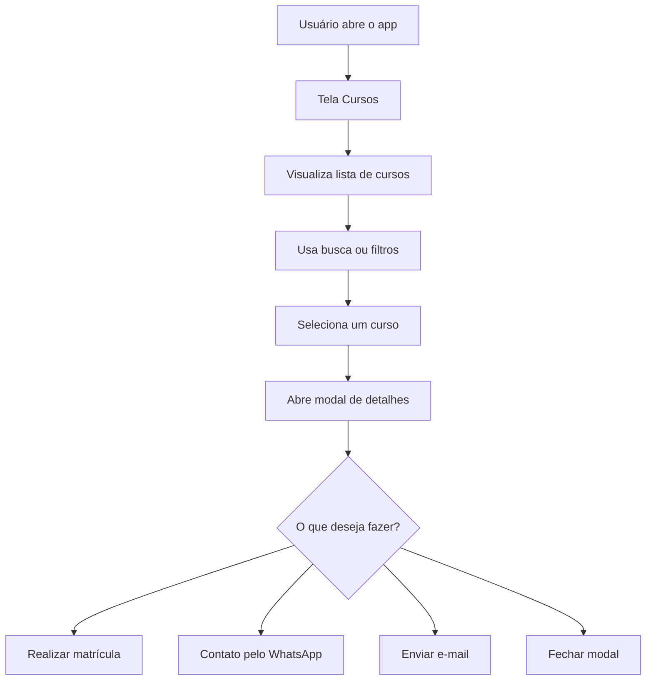
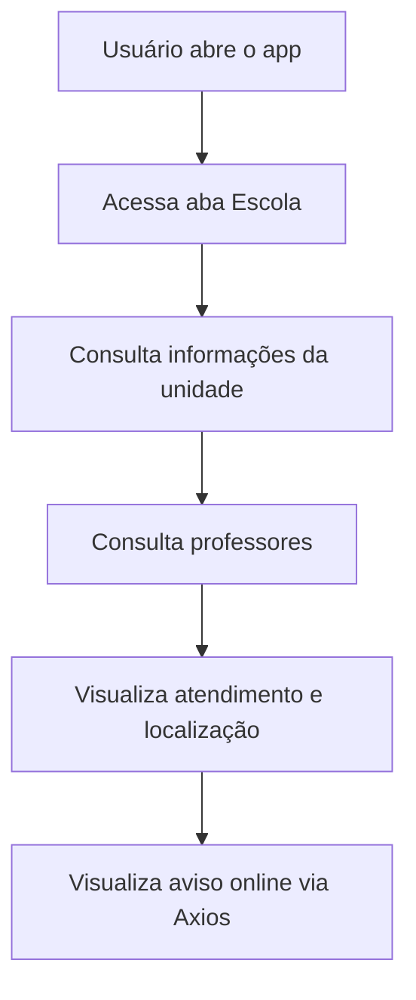
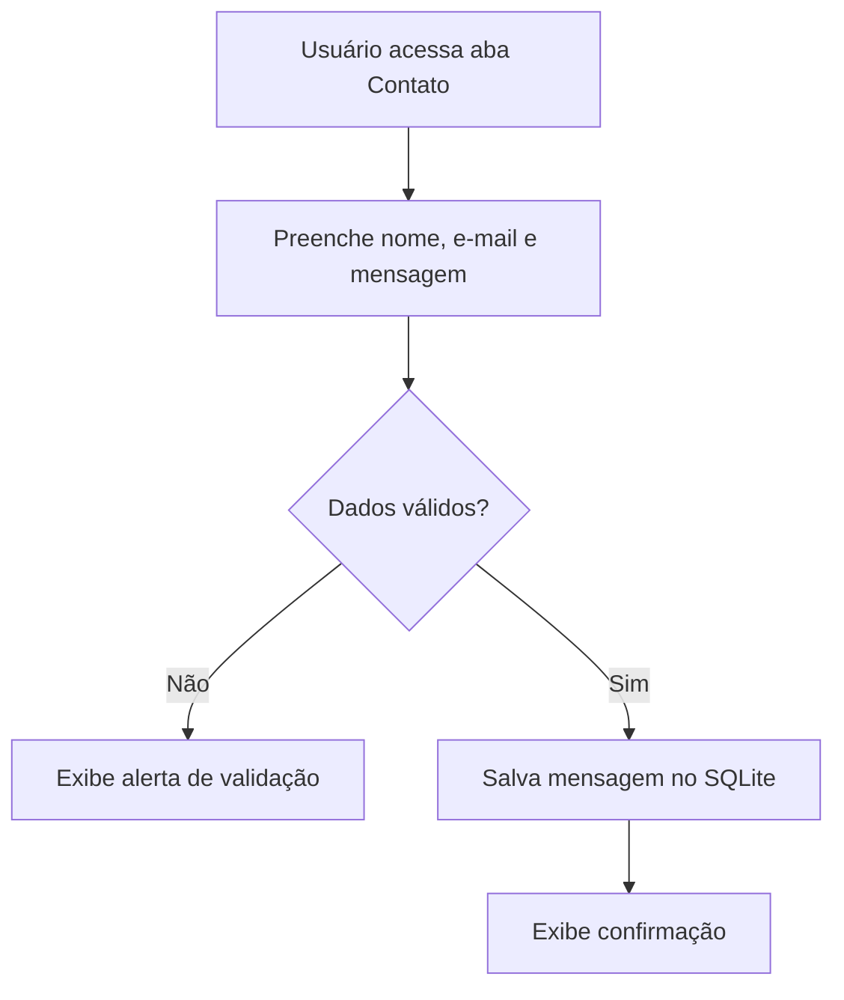

# Protótipo - SENAI Cursos

Este documento apresenta o protótipo textual e funcional do aplicativo **SENAI Cursos**, desenvolvido para divulgar os cursos de desenvolvimento da escola **SENAI Santo Amaro - Suíço-Brasileira "Paulo Ernesto Tolle"**.

O protótipo descreve a proposta visual, as telas, os componentes, os fluxos de navegação, as interações do usuário e a relação com os requisitos da sprint.

---

## 1. Objetivo do protótipo

O protótipo tem como objetivo orientar a construção do aplicativo mobile, garantindo que a experiência do usuário seja clara, agradável e interativa.

A proposta é criar um app que permita:

- consultar cursos de desenvolvimento;
- pesquisar e filtrar cursos;
- visualizar detalhes em uma modal;
- solicitar matrícula;
- entrar em contato com a escola;
- conhecer informações da unidade SENAI.

---

## 2. Identidade visual

### Nome do aplicativo

```txt
SENAI Cursos
```

### Estilo visual

O app utiliza uma interface moderna com:

- cabeçalho vermelho institucional;
- logo do SENAI;
- cards arredondados;
- ícones por área;
- cores auxiliares para diferenciar categorias;
- botões destacados;
- filtros opcionais para melhorar a experiência do usuário.

### Cores principais

| Elemento | Cor / proposta |
|---|---|
| Primária | Vermelho SENAI |
| Fundo | Cinza claro |
| Cards | Branco |
| Textos principais | Cinza escuro |
| Textos secundários | Cinza médio |
| Destaques | Cores específicas por área de curso |

### Imagens utilizadas

| Imagem | Uso |
|---|---|
| `senai-logo-white.png` | Cabeçalho vermelho. |
| `senai-logo-horizontal.png` | Identidade visual em áreas institucionais. |
| `senai-logo-symbol.png` | Ícone visual em tela sobre a escola. |
| `icon.png` | Ícone do aplicativo. |
| `adaptive-icon.png` | Ícone adaptativo Android. |
| `splash.png` | Tela inicial de carregamento. |

---

## 3. Público-alvo

O aplicativo é voltado para:

- estudantes interessados em cursos de desenvolvimento;
- alunos do SENAI;
- pessoas buscando formação em tecnologia;
- usuários que desejam conhecer cursos por área, nível, duração e professor.

---

## 4. Jornada do usuário

### Fluxo principal



### Fluxo institucional



### Fluxo de contato



---

## 5. Navegação do app

A navegação principal é feita por uma barra inferior com três abas:

| Aba | Função |
|---|---|
| **Cursos** | Exibe a lista de cursos, busca, filtros e detalhes. |
| **Escola** | Mostra informações institucionais da unidade e professores. |
| **Contato** | Apresenta formulário e canais de atendimento. |

### Estrutura visual da navegação

```txt
┌───────────────────────────────┐
│ Conteúdo da tela selecionada  │
│                               │
│                               │
├───────────────────────────────┤
│  Cursos   Escola   Contato    │
└───────────────────────────────┘
```

---

## 6. Tela 1 — Cursos

### Objetivo

Apresentar todos os cursos disponíveis e permitir que o usuário encontre rapidamente o curso desejado.

### Wireframe textual

```txt
┌─────────────────────────────────────┐
│ [Logo SENAI]                        │
│ SENAI Cursos                        │
│ SENAI Santo Amaro - Suíço-Brasileira│
│ trilhas de desenvolvimento...       │
└─────────────────────────────────────┘

┌─────────────────────────────────────┐
│ Encontre seu curso                  │
│ Pesquise pelo nome do curso...      │
│                                     │
│ [ Buscar curso, área ou professor ] │
│                                     │
│ Filtros: Nenhum filtro aplicado     │
│                         [Filtros]   │
└─────────────────────────────────────┘

Cursos disponíveis
18 cursos encontrados

┌─────────────────────────────────────┐
│ BANCO DE DADOS                 ★4.8 │
│ SQLite para Aplicativos             │
│ Banco local em apps mobile          │
│                                     │
│ ┌─────────────┐ ┌─────────────┐     │
│ │ Nível       │ │ Duração     │     │
│ │ Iniciante   │ │ 32 horas    │     │
│ └─────────────┘ └─────────────┘     │
│                                     │
│ Professor responsável               │
│ Prof. Atila                         │
│                                     │
│                         [Ver detalhes]
└─────────────────────────────────────┘
```

### Elementos da tela

| Elemento | Descrição |
|---|---|
| Header | Exibe logo SENAI, título e subtítulo. |
| Campo de busca | Busca por curso, área, nível, professor ou descrição. |
| Botão Filtros | Abre modal com filtros avançados. |
| Resumo de filtros | Mostra se há filtros aplicados. |
| Lista de cursos | Exibe os cursos em cards. |
| Card do curso | Mostra dados principais. |
| Botão Ver detalhes | Abre a modal do curso. |

---

## 7. Modal de filtros avançados

### Objetivo

Permitir refinamento da listagem sem deixar a tela principal visualmente carregada.

### Decisão de UX

Os filtros não ficam permanentemente expostos na tela. Eles aparecem apenas quando o usuário toca no botão **Filtros**. Isso melhora a organização visual e evita excesso de informação na página principal.

A modal só fecha quando o usuário toca em **Filtro concluído**, evitando fechamento acidental ao tocar fora da janela.

### Wireframe textual

```txt
┌─────────────────────────────────────┐
│ Filtros avançados                   │
│ Escolha os critérios desejados...   │
├─────────────────────────────────────┤
│ Área                                │
│ [Todos] [Front-end] [Back-end]      │
│ [Banco de dados] [UI/UX]            │
│ [Projetos com Scrum] [DevOps]       │
│                                     │
│ Nível                               │
│ [Todos] [Iniciante] [Intermediário] │
│ [Avançado]                          │
│                                     │
│ Professor                           │
│ [Todos] [Prof. Fiama]               │
│ [Prof. Atila] [Prof. Lucas]         │
│                                     │
│ Classificação mínima                │
│ [Todas] [4.6+] [4.8+] [4.9+]        │
│                                     │
│ Ordenar resultados por              │
│ [Melhor avaliação] [A-Z]            │
│ [Menor duração] [Nível]             │
├─────────────────────────────────────┤
│ [Limpar filtros] [Filtro concluído] │
└─────────────────────────────────────┘
```

### Filtros disponíveis

| Filtro | Opções |
|---|---|
| Área | Todos, Front-end, Back-end, Banco de dados, UI/UX, Projetos com Scrum, DevOps com nuvem. |
| Nível | Todos, Iniciante, Intermediário, Avançado. |
| Professor | Todos, Prof. Fiama, Prof. Atila, Prof. Lucas. |
| Classificação mínima | Todas, 4.6+, 4.8+, 4.9+. |
| Ordenação | Melhor avaliação, A-Z, menor duração, nível. |

---

## 8. Card de curso

### Objetivo

Exibir um resumo do curso de forma rápida, legível e atrativa.

### Informações exibidas

Cada card apresenta:

- área;
- título;
- subtítulo;
- nível;
- duração;
- professor responsável;
- classificação;
- botão **Ver detalhes**.

### Wireframe textual do card

```txt
┌─────────────────────────────────────┐
│ Faixa superior com cor da área      │
├─────────────────────────────────────┤
│ [Ícone] ÁREA                  ★ 4.8 │
│        Nome do curso                │
│        Subtítulo do curso           │
│                                     │
│ ┌─────────────────────────────────┐ │
│ │ Nível          Duração          │ │
│ │ Iniciante      32 horas         │ │
│ │                                 │ │
│ │ Professor responsável           │ │
│ │ Prof. Atila                     │ │
│ └─────────────────────────────────┘ │
│                                     │
│                         [Ver detalhes]
└─────────────────────────────────────┘
```

### Justificativa visual

O card foi organizado em blocos internos para melhorar a leitura. O usuário consegue identificar rapidamente a área, o nome do curso, a duração, o nível, o professor e a avaliação.

---

## 9. Modal de detalhes do curso

### Objetivo

Mostrar informações completas do curso e permitir ação imediata do usuário.

### Wireframe textual

```txt
┌─────────────────────────────────────┐
│ [Ícone da área] ÁREA                │
│ Nome do curso                       │
│ Subtítulo do curso                  │
│                                     │
│ [Nível] [Duração] [Classificação]   │
├─────────────────────────────────────┤
│ Sobre o curso                       │
│ Descrição completa do curso...      │
│                                     │
│ Professor responsável               │
│ Prof. Nome                          │
│                                     │
│ Atendimento da escola               │
│ SENAI Santo Amaro - Suíço-Brasileira│
│ Telefone: (11) 5642-3400            │
│ WhatsApp: (11) 5642-3407            │
│                                     │
│ [Realizar matrícula]                │
│ [Contato pelo WhatsApp]             │
│ [Enviar e-mail]                     │
│ [Fechar]                            │
└─────────────────────────────────────┘
```

### Ações da modal

| Botão | Ação |
|---|---|
| **Realizar matrícula** | Exibe alerta confirmando interesse no curso. |
| **Contato pelo WhatsApp** | Abre WhatsApp com mensagem automática sobre o curso. |
| **Enviar e-mail** | Abre e-mail com assunto e corpo preenchidos. |
| **Fechar** | Fecha a modal. |

---

## 10. Tela 2 — Escola

### Objetivo

Apresentar informações institucionais da escola, professores, atendimento e diferenciais do app.

### Wireframe textual

```txt
┌─────────────────────────────────────┐
│ [Logo SENAI]                        │
│ Sobre a escola                      │
│ Conheça a unidade, professores...   │
└─────────────────────────────────────┘

┌─────────────────────────────────────┐
│ [Símbolo SENAI]                     │
│ SENAI Santo Amaro - Suíço-Brasileira│
│ Formação profissional, tecnologia...│
│                                     │
│ Texto institucional sobre a escola  │
└─────────────────────────────────────┘

┌─────────────────────────────────────┐
│ Professores dos cursos              │
│ Prof. Fiama                         │
│ Descrição formal...                 │
│                                     │
│ Prof. Atila                         │
│ Descrição formal...                 │
│                                     │
│ Prof. Lucas                         │
│ Descrição formal...                 │
└─────────────────────────────────────┘

┌─────────────────────────────────────┐
│ Atendimento e localização           │
│ Endereço                            │
│ Rua Bento Branco de Andrade Filho...│
│ CEP: 04757-000                      │
│ Telefone: (11) 5642-3400            │
│ WhatsApp: (11) 5642-3407            │
└─────────────────────────────────────┘

┌─────────────────────────────────────┐
│ Integração online                   │
│ Aviso carregado via Axios           │
└─────────────────────────────────────┘
```

### Conteúdo apresentado

- nome completo da unidade;
- descrição institucional;
- professores;
- endereço;
- CEP;
- telefone;
- WhatsApp;
- diferenciais do app;
- aviso online carregado com Axios.

---

## 11. Tela 3 — Contato

### Objetivo

Permitir que o usuário envie uma mensagem para a escola e acesse canais de atendimento.

### Wireframe textual

```txt
┌─────────────────────────────────────┐
│ [Logo SENAI]                        │
│ Fale com a escola                   │
│ Tire dúvidas sobre cursos...        │
└─────────────────────────────────────┘

┌─────────────────────────────────────┐
│ Formulário de contato               │
│                                     │
│ Nome                                │
│ [Digite seu nome]                   │
│                                     │
│ E-mail                              │
│ [Digite seu e-mail]                 │
│                                     │
│ Mensagem                            │
│ [Digite sua mensagem]               │
│                                     │
│ [Enviar mensagem]                   │
└─────────────────────────────────────┘

┌─────────────────────────────────────┐
│ Atendimento                         │
│ [WhatsApp] [E-mail] [Telefone]      │
│                                     │
│ Endereço                            │
│ Rua Bento Branco de Andrade Filho...│
└─────────────────────────────────────┘
```

### Validações previstas

| Situação | Resposta do app |
|---|---|
| Nome vazio | Exibe alerta de campos obrigatórios. |
| E-mail vazio | Exibe alerta de campos obrigatórios. |
| Mensagem vazia | Exibe alerta de campos obrigatórios. |
| E-mail sem `@` | Exibe alerta de e-mail inválido. |
| Dados válidos | Salva no SQLite e exibe confirmação. |

---

## 12. Componentes do protótipo

### Header

Componente usado no topo das telas.

Contém:

- logo SENAI;
- título da tela;
- subtítulo explicativo.

### AdvancedFilters

Componente responsável por:

- campo de busca;
- botão de filtros;
- resumo de filtros aplicados;
- modal de filtros avançados;
- chips de seleção;
- botão limpar filtros;
- botão filtro concluído.

### CourseCard

Componente responsável por exibir o resumo de cada curso.

Contém:

- ícone da área;
- faixa superior colorida;
- área;
- título;
- subtítulo;
- classificação;
- nível;
- duração;
- professor;
- botão de detalhes.

### CourseDetailsModal

Componente responsável pela visualização completa do curso.

Contém:

- dados completos do curso;
- descrição;
- professor;
- informações de atendimento;
- matrícula;
- WhatsApp;
- e-mail.

### InfoPill

Componente visual usado para exibir pequenas informações como nível, duração e classificação.

---

## 13. Dados usados no app

### Dados da escola

```txt
SENAI Santo Amaro - Suíço-Brasileira "Paulo Ernesto Tolle"
Endereço: Rua Bento Branco de Andrade Filho, 379 - Santo Amaro - São Paulo/SP
CEP: 04757-000
Telefone: (11) 5642-3400
WhatsApp: (11) 5642-3407
```

### Professores

| Professor | Áreas de atuação |
|---|---|
| Prof. Fiama | Back-end com Java, lógica de programação e projetos integradores. |
| Prof. Atila | Front-end, mobile, banco de dados e lógica de programação. |
| Prof. Lucas | Front-end, mobile, lógica de programação e projetos. |

---

## 14. Cursos por área

O protótipo prevê no mínimo três cursos por área, conforme exigido na sprint.

| Área | Quantidade |
|---|---:|
| Front-end | 3 |
| Back-end | 3 |
| Banco de dados | 3 |
| UI/UX | 3 |
| Projetos com Scrum | 3 |
| DevOps com nuvem | 3 |
| **Total** | **18** |

---

## 15. Regras de interação

### Busca

- O campo de busca permanece visível na tela inicial.
- A digitação não deve fechar o teclado automaticamente.
- A busca filtra os cursos por texto.

### Filtros

- Os filtros ficam ocultos por padrão.
- O usuário abre os filtros pelo botão **Filtros**.
- A modal de filtros não fecha ao tocar fora.
- A modal fecha apenas no botão **Filtro concluído**.
- O botão **Limpar filtros** limpa os filtros sem fechar a modal.

### Cards

- O usuário pode tocar no card ou no botão **Ver detalhes**.
- O card abre a modal do curso.

### Modal do curso

- O usuário pode solicitar matrícula.
- O usuário pode abrir WhatsApp.
- O usuário pode abrir e-mail.
- O usuário pode fechar a modal.

### Formulário

- O formulário exige nome, e-mail e mensagem.
- O e-mail precisa conter `@`.
- Mensagens válidas são salvas no SQLite.

---

## 16. Estados do sistema

### Carregamento inicial

```txt
Preparando banco SQLite...
```

Esse estado aparece enquanto o app cria o banco local e carrega os cursos.

### Lista vazia

```txt
Nenhum curso encontrado
Tente buscar por outro termo ou combinar filtros diferentes.
```

Aparece quando a busca ou os filtros não retornam resultados.

### Erro no SQLite

```txt
Não foi possível carregar os cursos do banco SQLite.
```

Aparece se houver falha na inicialização ou consulta do banco.

### API offline

Caso o Axios não consiga obter o aviso online, o app mostra uma mensagem informando que continua funcionando com dados locais.

---

## 17. Acessibilidade e usabilidade

O protótipo considera:

- botões com textos claros;
- agrupamento visual por cards;
- cores consistentes;
- filtros opcionais para reduzir poluição visual;
- campos de formulário com labels;
- feedback por alertas;
- navegação inferior simples;
- hierarquia visual entre título, subtítulo e informações secundárias.

---

## 18. Relação com os requisitos da sprint

| Requisito | Como o protótipo atende |
|---|---|
| Página principal com todos os cursos | Tela Cursos com lista em cards. |
| Modal ao clicar no curso | CourseDetailsModal. |
| Título, subtítulo, nível, duração, área, professor e classificação | Exibidos no card e/ou modal. |
| Botão de matrícula | Disponível na modal. |
| Botão de contato | WhatsApp e e-mail disponíveis na modal. |
| SQLite | Cursos e mensagens persistidos localmente. |
| Biblioteca de interface | React Native Paper. |
| Informações sobre a escola | Tela Escola. |
| Informações de contato | Tela Contato e modal de curso. |
| Formulário e e-mail | Formulário salva no SQLite e e-mail abre via Linking. |
| Mínimo de três cursos por área | 18 cursos organizados em seis áreas. |
| Axios | Integração online na tela Escola. |

---

## 19. Critérios de aceite

O protótipo será considerado atendido quando:

- [x] a tela inicial listar os cursos;
- [x] cada curso exibir os dados obrigatórios;
- [x] o usuário conseguir abrir uma modal de detalhes;
- [x] o usuário conseguir solicitar matrícula;
- [x] o usuário conseguir acessar canais de contato;
- [x] o aplicativo tiver dados salvos no SQLite;
- [x] o app usar Axios;
- [x] o app usar React Native Paper;
- [x] existir tela institucional da escola;
- [x] existir tela de contato com formulário;
- [x] houver pelo menos 3 cursos por área;
- [x] o design for agradável e organizado.

---

## 20. Conclusão do protótipo

O protótipo do **SENAI Cursos** define uma experiência simples, direta e funcional para divulgação dos cursos de desenvolvimento da unidade SENAI Santo Amaro - Suíço-Brasileira.

A solução combina interface visual organizada, navegação por abas, cards informativos, filtros avançados opcionais, modal de detalhes, persistência local com SQLite, consumo de API com Axios e canais de contato com a escola.

Dessa forma, o protótipo atende aos requisitos da sprint e serve como base para a implementação completa do aplicativo mobile.
